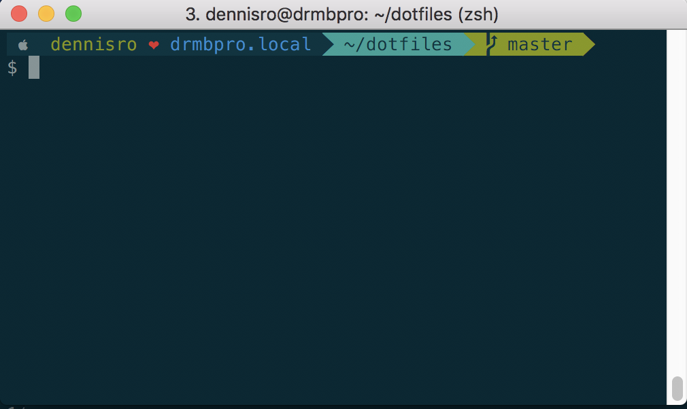

## My dotfiles

### To initialize run:

`./init.sh`

### What does it do?

1. Set some useful defaults (`defaults.sh`)
2. Install [Homebrew](https://brew.sh/)
3. Install packages via Brewfile
4. Install [oh-my-zsh](https://github.com/robbyrussell/oh-my-zsh)
4. Symlink dotfiles to `~/`
5. Add brewed `bash` and `zsh` to `/etc/shells`
6. Switch login shell to `/usr/local/bin/zsh`
7. Source `.zshrc` and reload shell

### Manual steps

1. In directory `./Terminal`

    1. Install Solarized themes for iTerm & Terminal
    2. Install font `Meslo LG S Regular for Powerline`
    3. Change font in iTerm/Terminal prefs

### chaosbunker.zsh-theme

